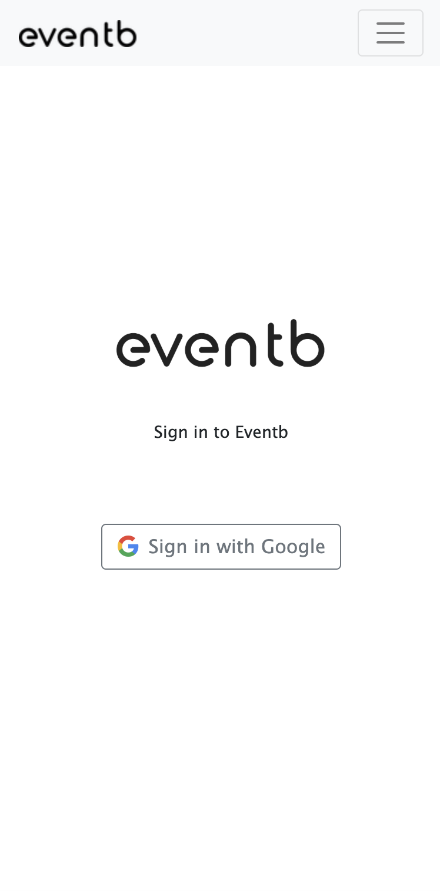
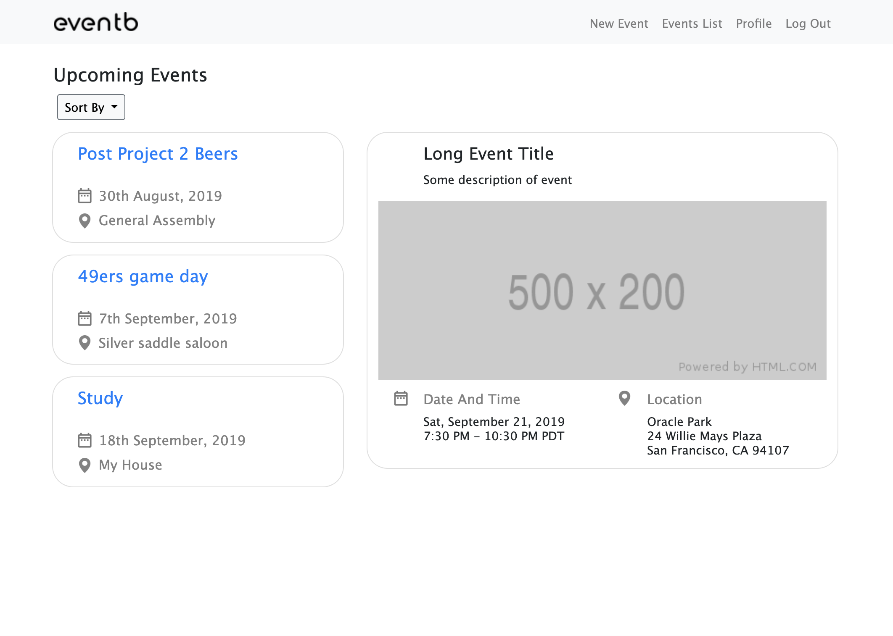

# Event Planner

Event Planner is going to create a web-based event management system that will simplify event planning for groups that are small to mid-size by creating a centralized hub that allows users to manage, collaborate, and track events.

# Screenshots:

 

# Technologies Used
* HTML
* CSS
* Javascript
* Express
* MongoDB
* OAuth

# Getting Started

* Requires sign in to Google to create events.
* Profile view allows editing/deleting events.
* All users allowed to comment on any event.
* Users may not delete other users events.

[Click here!](https://alyplans.herokuapp.com)

# Next Steps
* Polls on events to help with making decisions.
* Google maps locations for visuals and directions.
* More desktop content.